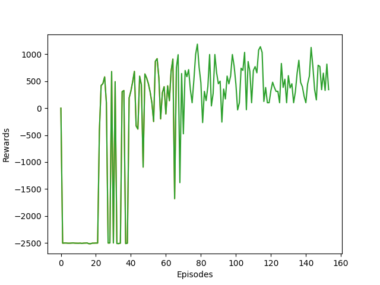

# Project Name : ENDGAME

### Project Description  : 
Final project of EVA #3 course from [The School of A.I Bangalore](https://theschoolof.ai/) .
We have to make a car to drive by itself and reach its destinations by Twin delayed deep deterministic network . I have used pygame as stimulator/frontend


**Contents**

- [Wiki](#wiki)      
   * [Description](#Description)
   * [Environment](#Environment)
   * [Observation](#Observation)
   * [Action](#Action)
   * [Reward](#Reward)
   * [Starting State](#Starting-State)
   * [Episode Termination](#Episode-Termination) 
- [Experiment Procedure and Results](#Experiment-Procedure-and-Results)
   * [Requirements](#Requirements)
   * [Train in Local](#Train-in-Local)
   * [Inference in Local](#Inference-in-Local)
   * [Train in colab](#Train-in-colab)
   * [Inference in Colab](#Inference-in-Colab)
   * [Actor Critic - Architecture](#Actor-Critic---Architecture)
   * [The Eye - Cropped Image](#The-Eye---Cropped-Image)
   * [Car Movement](#Car-Movement)
   * [Youtube Link](#Youtube-Link)
   * [Graph](#Graph)
   * [Further Possible Extension](#Further-Possible-Extension)
   * [Credits](#Credits )


## WiKi

* Name : SelfDrivingCar-V1
* Category : Box2D

### Description :

Make a car to reach its destination by moving over road without going inside sand

## Environment

**Stimulator** : Pygame*

*Note : In pygame the origin starts from bottom left corner so we have to make changes to goal positions and location of car in accordance with it . So height of the map is subtracted with the position of car and also with the goal position .

**Map** : 1429x660 dimension

### Observation

Type: Box(4)

Num | Observation                                       |       Min        |     Max         |    Mean 
:---:|:---------------------------------------------------:|:------------------:|:-----------------:|:----------:
0   | croppedImage                                      |  [0]x(cropSize)  |  [1]x(cropSize) | None 
1   | orientation                                       |     -1            |   +1           | 0
2   | -orientation                                      |    -1            |    +1         | 0
3   | change in distance(previous distance from goal - current distance from goal)   |   0.5            | 1.8             | 1.15


### Actions

Type : Box(1)

Num  |   Name          | min  | Max action
:---:|:---------------:|:----:|:----------:
0    | Steering Angle  | -5   |  5


### Reward:

   Situation                                                 |         Points
:-------------------------------------------------------------:|:--------------------:
Goal is reached                                              |         100 
Near boundary                                                |         -15 
Sand / Non road area                                         |          -6
Road and the step is far from goal from previous step        |          -2
Road and the step is near from goal from previous step       |          +2 


### Starting State:

Origin - (725,274)

Angle - 0 

First 6000 time steps are random actions 


### Episode Termination :

* case 1 :  if the rewards are less than -2500

* case 2 :  if the car reaches its destination

* case 3  : Maximum number of time steps : 2e6


## Experiment Procedure and Results 


### Requirements

``` pip install -r requirements.txt ```

* pygame==1.9.6
* matplotlib==3.2.1
* scipy==1.4.1
* pillow==7.1.2
* numpy==1.18.1
* torch==1.5.0

### Train in Local

```python main.py --operation train_car ```

You can get good inference in 90 episode but its advisable to train till 180 episodes and if u want 
good stablity then 400 or more is recommended .

### Inference in Local

``` python main.py --operation test_car ```

### Train in colab

[Notebook Link](EndGame_SelfDrivingCarv1_PS10.ipynb)

Mounting drive on colab

```
from google.colab import drive
drive.mount('/content/drive')
```

Neglecting the popup and training in colab GPU

```
!pip install pygame 

import os
os.environ['SDL_VIDEODRIVER']='dummy'
import pygame
```


### Inference in Colab

its not possible to infer on colab so download the weights(.pth) file from drive/colab to local machine and then infer using above command

### Actor Critic - Architecture

Actor :
Channels | Kernel Size |Stride | Activation | Normalization
:-------:|:-----------:|:----:|:----------:|:-------:
8        |   3x3       | 1     |   Relu     |  BN
10       |   3x3       | 1     |   Relu     |  BN
12       |   3x3       | 2     |   Relu     |   BN 
16       |   3x3       | 1     |   Relu     |   BN
   | |    | AdaptiveAveragePool2d | 
-----------------------------------------------------------
       


Critic A:

Channels | Kernel Size |Stride | Activation | Normalization
:-------:|:-----------:|:----:|:----------:|:-------:
8        |   3x3       | 1     |   Relu     |  BN
10       |   3x3       | 1     |   Relu     |  BN
12       |   3x3       | 2     |   Relu     |   BN 
16       |   3x3       | 1     |   Relu     |   BN
   | |    | AdaptiveAveragePool2d | 
-----------------------------------------------------------


Critic B :

Channels | Kernel Size |Stride | Activation | Normalization
:-------:|:-----------:|:----:|:----------:|:-------:
8        |   3x3       | 1     |   Relu     |  BN
10       |   3x3       | 1     |   Relu     |  BN
12       |   3x3       | 2     |   Relu     |   BN 
16       |   3x3       | 1     |   Relu     |   BN
   | |    | AdaptiveAveragePool2d | 
-----------------------------------------------------------


### The Eye - Cropped Image

* Crop a large image of 56x56 
* Mark the cars position in both white and black pixel (To identify the Car both in road and sand) with 7x7 size
* Rotate it in accodance with the cars angle 
* Shrink the Cropped image to 28x28 


### Car Movement

* Cars movement is calculated with Velocity of the car is multiplied with the cars position
* Angle calculation is made and then direction is decided from the action got from TD3
* Rewards are given in accordance with position of the car (sand or road) and then nearness to the goal from previous car position 

### Youtube Link

[Result - The Link - Click Here](https://www.youtube.com/watch?v=ykfbnSXA3Yc)

### Graph 

Reward Vs Episode



### Further Possible Extension

* Make multi agent cars(say 4) and train it to reach respective multiple destinations without colliding with each other by road 

* Make multi agent cars(say 4) and have 100 destinations train it to reach multiple destinations without colliding with each other by road as fast as possible.(Logistics problem -swiggy,zomato) . 


### Credits 

* [Rohan Shravan](https://www.google.com/search?safe=active&sxsrf=ALeKk03ViVAZ5ek_9vHbQ4Lg7UXMqN-rMA%3A1592201626546&ei=mhHnXrL-IO-e4-EPq4GH8AU&q=Rohan+Shravan&oq=Rohan+Shravan&gs_lcp=CgZwc3ktYWIQAzIECCMQJzICCAAyBAgAEB4yBAgAEB4yBAgAEB4yBAgAEB4yBAgAEB4yBggAEAUQHjIECAAQHjoECAAQRzoHCCMQsAIQJzoECAAQDToGCAAQDRAeUKObBVjFswVg_bcFaABwAXgAgAGmAogB6gWSAQUwLjMuMZgBAKABAaoBB2d3cy13aXo&sclient=psy-ab&ved=0ahUKEwiys_GilYPqAhVvzzgGHavAAV4Q4dUDCAw&uact=5) 
* [The School of A.I ](https://theschoolof.ai/)
