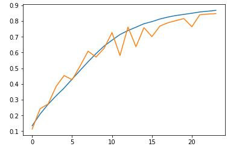
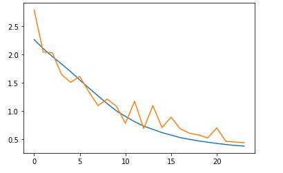

## Training logs

    
    98it [00:57, 1.20s/it]

    epoch: 1 lr: 0.14400000000000002 train loss: 2.261865163574219 train acc: 0.13478 val loss: 2.786708319091797 val acc: 0.1134 time: 60.567811012268066

    98it [00:37, 3.77it/s]

    epoch: 2 lr: 0.20800000000000002 train loss: 2.1029900061035156 train acc: 0.20966 val loss: 2.0427508239746093 val acc: 0.2433 time: 102.74837732315063

    98it [00:38, 3.65it/s]

    epoch: 3 lr: 0.272 train loss: 1.9631779846191406 train acc: 0.27162 val loss: 2.0280116088867186 val acc: 0.273 time: 142.74791359901428

    98it [00:37, 3.62it/s]

    epoch: 4 lr: 0.336 train loss: 1.833234296875 train acc: 0.3249 val loss: 1.6480819427490234 val acc: 0.3847 time: 182.10918951034546

    98it [00:37, 3.65it/s]

    epoch: 5 lr: 0.4 train loss: 1.6970584875488282 train acc: 0.37446 val loss: 1.5090580535888671 val acc: 0.454 time: 221.40146374702454

    98it [00:38, 3.65it/s]

    epoch: 6 lr: 0.37333333333333335 train loss: 1.5498657153320312 train acc: 0.43082 val loss: 1.6121965454101563 val acc: 0.427 time: 261.5426049232483

    98it [00:38, 3.59it/s]

    epoch: 7 lr: 0.3466666666666667 train loss: 1.4077288366699219 train acc: 0.48662 val loss: 1.3398202880859376 val acc: 0.5143 time: 301.84239864349365

    98it [00:37, 3.59it/s]

    epoch: 8 lr: 0.32 train loss: 1.2690854852294922 train acc: 0.54138 val loss: 1.0982205169677735 val acc: 0.6089 time: 341.25021481513977

    98it [00:37, 3.65it/s]

    epoch: 9 lr: 0.29333333333333333 train loss: 1.1335821997070312 train acc: 0.59358 val loss: 1.2132048248291016 val acc: 0.5715 time: 381.1726655960083

    98it [00:38, 3.58it/s]

    epoch: 10 lr: 0.2666666666666667 train loss: 1.0071158935546876 train acc: 0.64088 val loss: 1.0885076690673827 val acc: 0.6264 time: 421.18708848953247

    98it [00:37, 3.62it/s]

    epoch: 11 lr: 0.24000000000000002 train loss: 0.9073698120117187 train acc: 0.67856 val loss: 0.7876330657958984 val acc: 0.727 time: 461.15051078796387

    98it [00:38, 3.59it/s]

    epoch: 12 lr: 0.21333333333333335 train loss: 0.8148772729492187 train acc: 0.71464 val loss: 1.1740633605957032 val acc: 0.5814 time: 501.2019009590149

    98it [00:37, 3.63it/s]

    epoch: 13 lr: 0.18666666666666668 train loss: 0.7371962780761718 train acc: 0.74006 val loss: 0.6941016296386718 val acc: 0.762 time: 540.3954811096191

    98it [00:37, 3.64it/s]

    epoch: 14 lr: 0.16 train loss: 0.679996427307129 train acc: 0.7611 val loss: 1.0984404022216796 val acc: 0.6372 time: 579.608035326004

    98it [00:37, 3.67it/s]

    epoch: 15 lr: 0.13333333333333336 train loss: 0.6223925213623047 train acc: 0.78322 val loss: 0.7129218856811523 val acc: 0.7583 time: 619.0117914676666

    98it [00:37, 3.69it/s]

    epoch: 16 lr: 0.10666666666666669 train loss: 0.578613896484375 train acc: 0.79676 val loss: 0.8953539916992187 val acc: 0.7012 time: 658.0531885623932

    98it [00:36, 3.68it/s]

    epoch: 17 lr: 0.08 train loss: 0.5332163101196289 train acc: 0.8132 val loss: 0.6883235733032227 val acc: 0.7686 time: 696.9689671993256

    98it [00:37, 3.64it/s]

    epoch: 18 lr: 0.06857142857142857 train loss: 0.5043823773193359 train acc: 0.82566 val loss: 0.6121953491210937 val acc: 0.7894 time: 735.985011100769

    98it [00:36, 3.71it/s]

    epoch: 19 lr: 0.05714285714285715 train loss: 0.47539497436523437 train acc: 0.8355 val loss: 0.581309619140625 val acc: 0.8031 time: 774.8899958133698

    98it [00:36, 3.69it/s]

    epoch: 20 lr: 0.045714285714285714 train loss: 0.4537761975097656 train acc: 0.84258 val loss: 0.5269627502441406 val acc: 0.816 time: 813.6453313827515

    98it [00:36, 3.67it/s]

    epoch: 21 lr: 0.03428571428571429 train loss: 0.4316020184326172 train acc: 0.85002 val loss: 0.7048325164794922 val acc: 0.7642 time: 852.3122143745422

    98it [00:37, 3.65it/s]

    epoch: 22 lr: 0.02285714285714286 train loss: 0.4124820835876465 train acc: 0.858 val loss: 0.46731015090942385 val acc: 0.8405 time: 891.4244866371155

    98it [00:36, 3.69it/s]

    epoch: 23 lr: 0.011428571428571427 train loss: 0.3963871014404297 train acc: 0.86288 val loss: 0.4564767593383789 val acc: 0.8445 time: 930.1140277385712

    98it [00:36, 3.68it/s]

    epoch: 24 lr: 0.0 train loss: 0.3851209484863281 train acc: 0.86826 val loss: 0.44388580017089846 val acc: 0.8472 time: 968.8844974040985

Final Accuracy :

    84.72%

    

Training graph

Loss graph

Group Members :

    Amul Patil
    Sagar
    Pragyan
    Ajith Kumar (Myself)